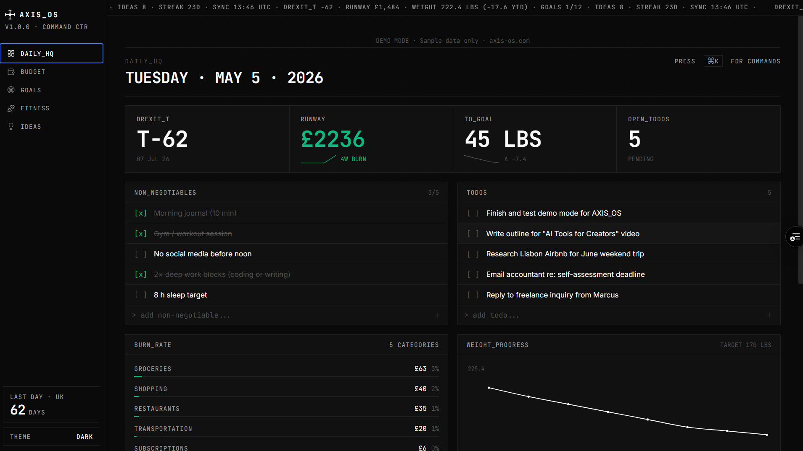

# Axis OS

Personal command center for budget, fitness, goals, and business ideas — terminal-aesthetic dashboard with demo mode, no account required.

[Live Demo →](https://axis.javiertpadilla.com) | [Portfolio →](https://javiertpadilla.com)



## What it does

- **Budget tracker:** CSV import, savings goals, spending analytics
- **Fitness tracker:** Weight, BMI, and body composition over time
- **Goal timeline:** Progress tracking across life areas
- **Business idea kanban:** Direction, priority, and status board
- **Command palette:** Ctrl+K quick navigation across all modules
- **Demo mode:** Read-only fixture data, no account or signup required
- **PWA support:** Installable on mobile and desktop via add to home screen
- **Dark and light mode**

## Stack

Next.js 14 · TypeScript · Tailwind CSS · shadcn/ui · Supabase (PostgreSQL) · Recharts · date-fns · dnd-kit

## Run locally

```bash
npm install
cp .env.local.example .env.local
# Fill in your Supabase credentials in .env.local
npm run dev
```

## Deploy

Deploys to Vercel. Requires a Supabase project for auth and data persistence. Demo mode works without any credentials.

